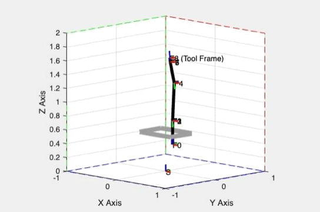
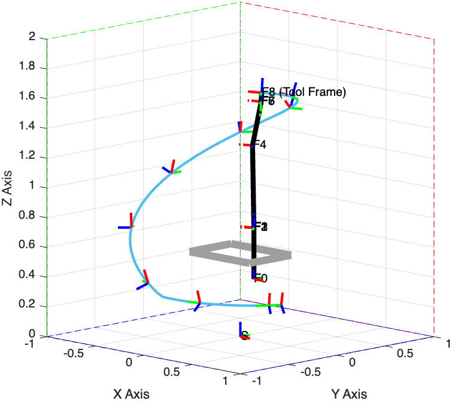
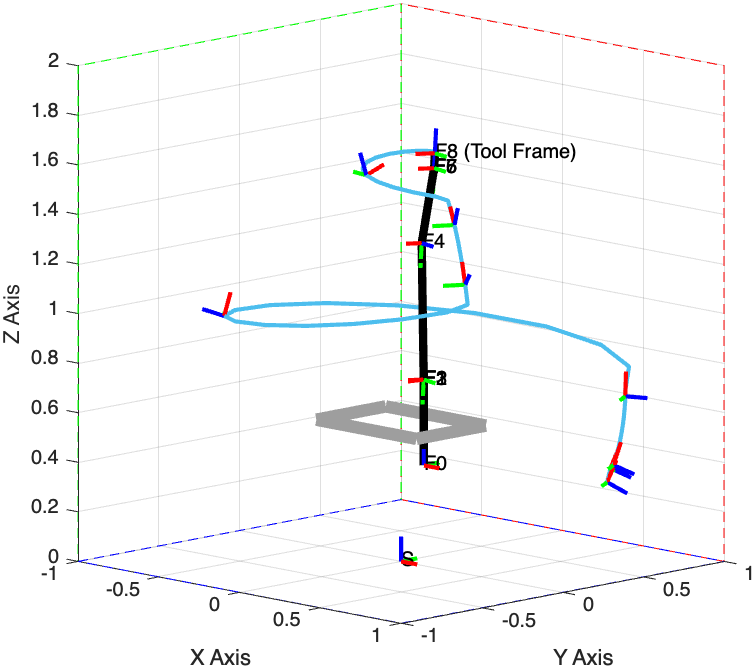

# project-GMPIC

Geometric Metric Predictive Impedance Control on SE(3) Manifold

- Our Project Folder: **Geometric-Impedence-MPC**
- Animation Generated in **MATLAB**:
- 

## 1. Results for Feedback Linearization PID Controller:

|          | Reference                                                    | Feedback                                                     |                                                              |
| -------- | ------------------------------------------------------------ | ------------------------------------------------------------ | ------------------------------------------------------------ |
| F_EE = 0 |  | ![trajectory_fb_controller_P[1]I[0_8]D[1]](README.assets/trajectory_fb_controller_P[1]I[0_8]D[1].png) | ![EE_position_P[1]I[0_8]D[1]](README.assets/EE_position_P[1]I[0_8]D[1]-8432261.png) |
| F_EE = k |  | ![trajectory_fb_controller_P[1]I[0_8]D[1]](README.assets/trajectory_fb_controller_P[1]I[0_8]D[1]-8432236.png) | ![EE_position_P[1]I[0_8]D[1]](README.assets/EE_position_P[1]I[0_8]D[1].png) |
| F_EE(t)  |  | ![trajectory_fb_controller_P[1]I[0_8]D[1]](README.assets/trajectory_fb_controller_P[1]I[0_8]D[1]-8432292.png) | ![EE_position_P[1]I[0_8]D[1]](README.assets/EE_position_P[1]I[0_8]D[1]-8432298.png) |

## 2. Results for MPC:

- Pending ...

## 3. Our Utils in MATLAB:

- Lie in Murray format, with OpenChain in Murray (v,w)
- OpenChainMR but in Murray format (v,w)
- RBT: rigid body transformation
- WAM_model: modelling for WAM in SE3 with twist/wrench
- Validate: validator, can be turned off for run-time performance

## A. Ref:

### A.1 Error State MPC:

>  https://github.com/UMich-CURLY/Error-State-MPC

#### A.1.1 Installation dependencies:

[OSQP Solver Oxford]

>  https://osqp.org/docs/get_started/matlab.html for matlab

### Geometric-Impedance-Control-Public:

> IFAC world congress 2023:
> "Geometric Impedance Control on SE(3) for Robotic Manipulators"
>
> arxiv submitted version:
> https://doi.org/10.48550/arXiv.2211.07945

